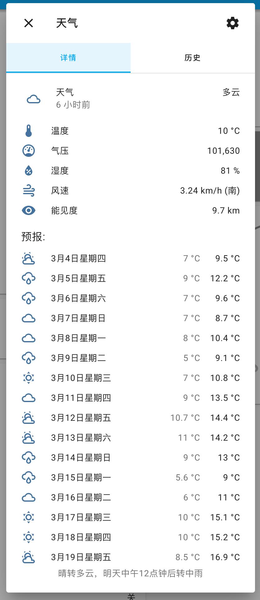

# ZhiCaiYun

CaiYun Weather Component for HomeAssistant

彩云天气的标准天气插件，支持 15 天预报。

## 1. 安装准备

把 `zhicaiyun` 放入 `custom_components`；也支持在 [HACS](https://hacs.xyz/) 中添加自定义库的方式安装。

## 2. 配置方法

参见[我的 Home Assistant 配置](https://github.com/Yonsm/.homeassistant)中 [configuration.yaml](https://github.com/Yonsm/.homeassistant/blob/main/configuration.yaml)

```
weather:
  - platform: zhicaiyun
    name: 天气
```



其中的 `attribution` 属性是彩云天气特有的关键天气描述，一句话非常明了。另外 [ZhiDash](https://github.com/Yonsm/ZhiDash) 也可以配合支持这个天气插件。

## 3. 参考

-   [ZhiDash](https://github.com/Yonsm/ZhiDash)
-   [Yonsm.NET](https://yonsm.github.io/caiyun)
-   [Hassbian.com](https://bbs.hassbian.com/thread-2697-1-1.html)
-   [Yonsm's .homeassistant](https://github.com/Yonsm/.homeassistant)